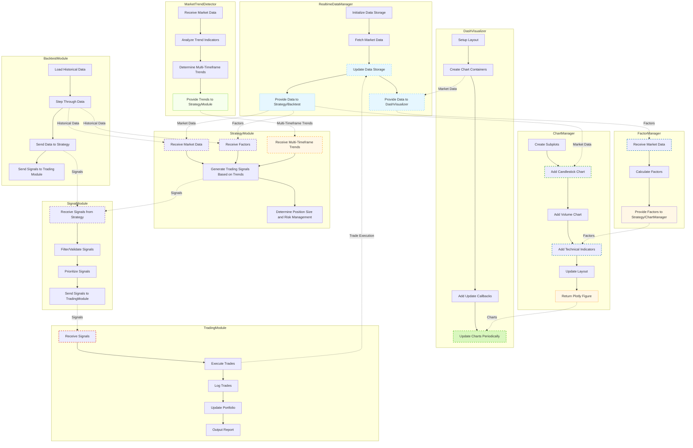

```mermaid
graph TD  
    %% DashVisualizer 子图  
    subgraph DashVisualizer  
        DV1[Setup Layout]  
        DV2[Create Chart Containers]  
        DV3[Add Update Callbacks]  
        DV4[Update Charts Periodically]  
        DV1 --> DV2  
        DV2 --> DV3  
        DV3 --> DV4  
    end  

    %% RealtimeDataManager 子图  
    subgraph RealtimeDataManager  
        RDM1[Initialize Data Storage]  
        RDM2[Fetch Market Data]  
        RDM3[Update Data Storage]  
        RDM4[Provide Data to DashVisualizer]  
        RDM5[Provide Data to Strategy/Backtest]  
        RDM1 --> RDM2  
        RDM2 --> RDM3  
        RDM3 --> RDM4  
        RDM3 --> RDM5  
    end  

    %% FactorManager 子图  
    subgraph FactorManager  
        FM1[Receive Market Data]  
        FM2[Calculate Factors]  
        FM3[Provide Factors to Strategy/ChartManager]  
        FM1 --> FM2  
        FM2 --> FM3  
    end  

    %% MarketTrendDetector 子图  
    subgraph MarketTrendDetector  
        MTD1[Receive Market Data]  
        MTD2[Analyze Trend Indicators]  
        MTD3[Determine Multi-Timeframe Trends]  
        MTD4[Provide Trends to StrategyModule]  
        MTD1 --> MTD2  
        MTD2 --> MTD3  
        MTD3 --> MTD4  
    end  

    %% ChartManager 子图  
    subgraph ChartManager  
        CM1[Create Subplots]  
        CM2[Add Candlestick Chart]  
        CM3[Add Volume Chart]  
        CM4[Add Technical Indicators]  
        CM5[Update Layout]  
        CM6[Return Plotly Figure]  
        CM1 --> CM2  
        CM2 --> CM3  
        CM3 --> CM4  
        CM4 --> CM5  
        CM5 --> CM6  
    end  

    %% StrategyModule 子图  
    subgraph StrategyModule  
        SM1[Receive Market Data]  
        SM2[Receive Factors]  
        SM3[Receive Multi-Timeframe Trends]  
        SM4[Generate Trading Signals Based on Trends]  
        SM5[Determine Position Size and Risk Management]  
        SM1 --> SM4  
        SM2 --> SM4  
        SM3 --> SM4  
        SM4 --> SM5  
    end  

    %% SignalModule 子图  
    subgraph SignalModule  
        SIG1[Receive Signals from Strategy]  
        SIG2[Filter/Validate Signals]  
        SIG3[Prioritize Signals]  
        SIG4[Send Signals to TradingModule]  
        SIG1 --> SIG2  
        SIG2 --> SIG3  
        SIG3 --> SIG4  
    end  

    %% TradingModule 子图  
    subgraph TradingModule  
        TM1[Receive Signals]  
        TM2[Execute Trades]  
        TM3[Log Trades]  
        TM4[Update Portfolio]  
        TM5[Output Report]  
        TM1 --> TM2  
        TM2 --> TM3  
        TM3 --> TM4  
        TM4 --> TM5  
    end  

    %% BacktestModule 子图  
    subgraph BacktestModule  
        BT1[Load Historical Data]  
        BT2[Step Through Data]  
        BT3[Send Data to Strategy]  
        BT4[Send Signals to Trading Module]  
        BT1 --> BT2  
        BT2 --> BT3  
        BT3 --> BT4  
    end  

    %% 模块间交互  
    DV2 -.->|Market Data| RDM4:::blueArrow  
    RDM4 -.->|Factors| FM1:::blueArrow  
    FM3 -.->|Factors| CM4:::blueArrow  
    RDM5 -.->|Market Data| CM2:::greenArrow  
    CM6 -.->|Charts| DV4:::blueArrow  
    RDM5 -.->|Market Data| SM1:::greenArrow  
    RDM5 -.->|Factors| SM2:::greenArrow  
    MTD4 -.->|Multi-Timeframe Trends| SM3:::greenArrow  
    SM4 -.->|Signals| SIG1:::redArrow  
    SIG4 -.->|Signals| TM1:::redArrow  
    BT2 -.->|Historical Data| SM1:::purpleArrow  
    BT2 -.->|Historical Data| SM2:::purpleArrow  
    BT3 -.->|Signals| SIG1:::purpleArrow  
    TM2 -.->|Trade Execution| RDM3:::orangeArrow  

    %% 设置箭头颜色  
    classDef blueArrow stroke:#1f77b4,stroke-width:2px,stroke-dasharray:5 5;  
    classDef greenArrow stroke:#2ca02c,stroke-width:2px,stroke-dasharray:5 5;  
    classDef redArrow stroke:#d62728,stroke-width:2px,stroke-dasharray:5 5;  
    classDef purpleArrow stroke:#9467bd,stroke-width:2px,stroke-dasharray:5 5;  
    classDef orangeArrow stroke:#ff7f0e,stroke-width:2px,stroke-dasharray:5 5;  
    
    %% 设置模块颜色  
    style DV4 fill:#d9f7be,stroke:#52c41a  
    style RDM3 fill:#e6f7ff,stroke:#91d5ff   
    style RDM4 fill:#e6f7ff,stroke:#91d5ff   
    style RDM5 fill:#e6f7ff,stroke:#91d5ff   
    style FM3 fill:#fff7e6,stroke:#9370db  
    style MTD4 fill:#f6ffed,stroke:#73d13d  
    style SM3 fill:#fff7e6,stroke:#ffa940  
    style CM6 fill:#fff7e6,stroke:#ffa940
```

